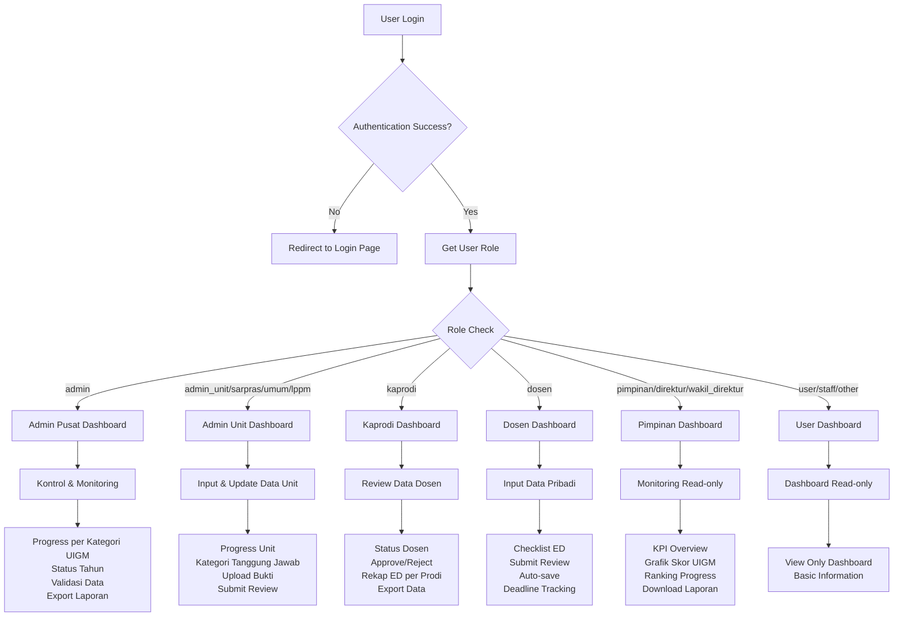
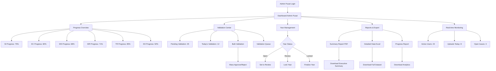
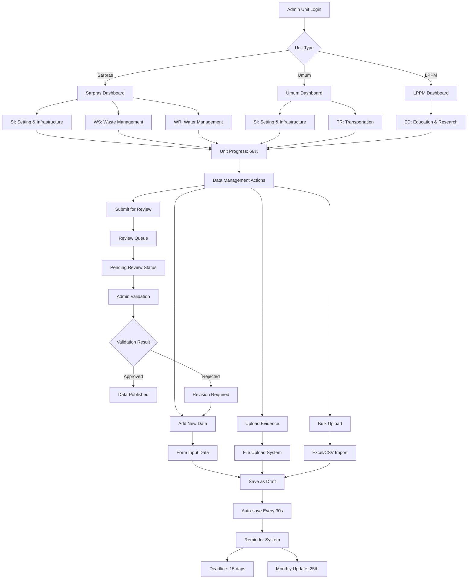
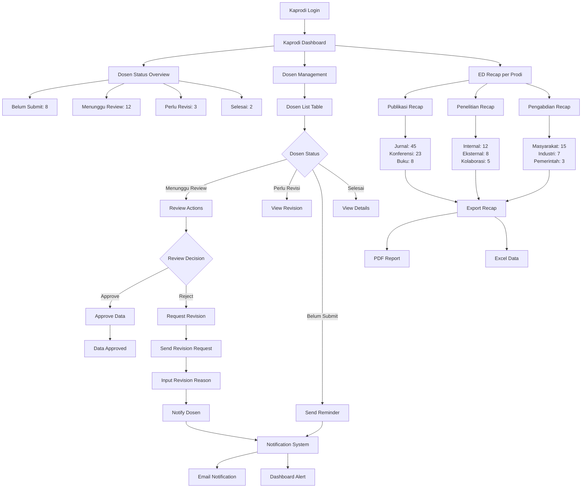
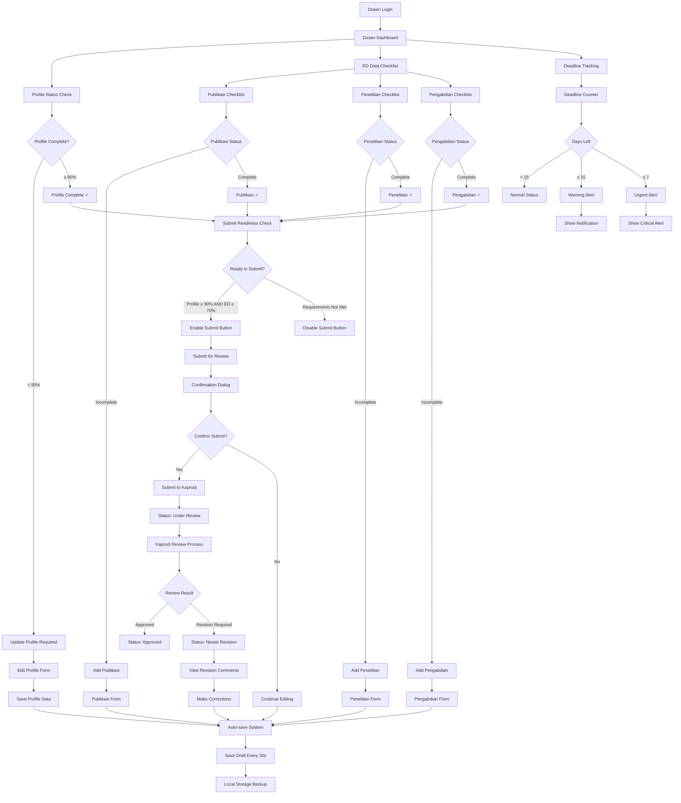
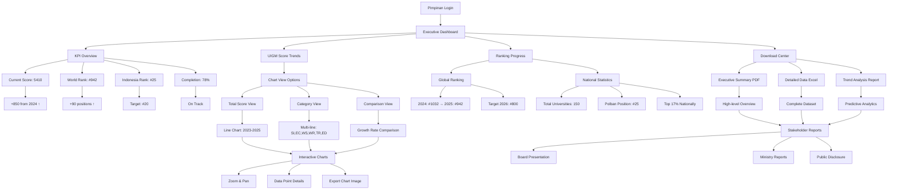
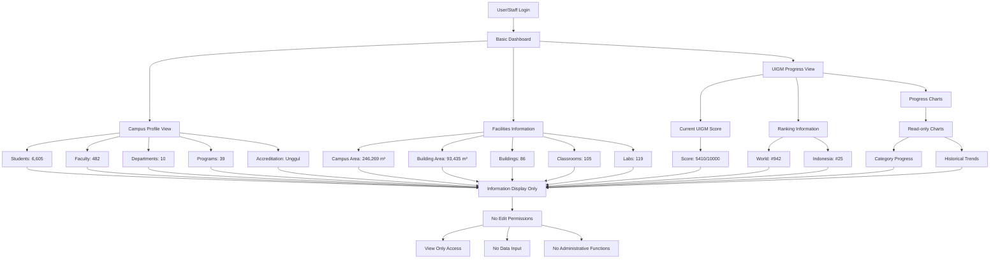
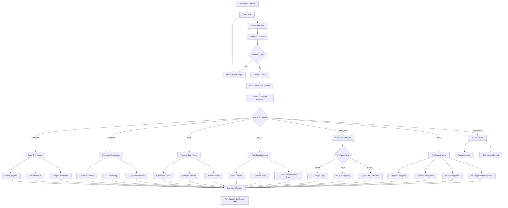

# Flowchart Sistem Role Dashboard UIGM

## 1. Flowchart Utama - Role-Based Dashboard System

## 2. Flowchart Admin Pusat - Kontrol & Monitoring

## 3. Flowchart Admin Unit - Input & Update Data

## 4. Flowchart Kaprodi - Review Data Dosen

## 5. Flowchart Dosen - Input Data Pribadi

## 6. Flowchart Pimpinan - Monitoring Read-only

## 7. Flowchart User/Staff - Read-only Dashboard

## 8. Flowchart Authentication & Authorization

---

## Keterangan Singkatan:

- **SI**: Setting & Infrastructure
- **EC**: Energy & Climate Change
- **WS**: Waste Management
- **WR**: Water Management
- **TR**: Transportation
- **ED**: Education & Research
- **UIGM**: UI GreenMetric World University Ranking
- **KPI**: Key Performance Indicators

## Cara Menggunakan Flowchart:

1. **Copy kode Mermaid** dari section yang dibutuhkan
2. **Paste ke Mermaid editor** online (mermaid.live) atau tools yang mendukung
3. **Export sebagai image** (PNG/SVG) untuk presentasi
4. **Embed di dokumentasi** atau wiki internal

Flowchart ini menggambarkan **alur kerja lengkap** untuk setiap role dalam sistem dashboard UIGM, mulai dari login hingga fungsi-fungsi spesifik yang dapat diakses oleh masing-masing role.
